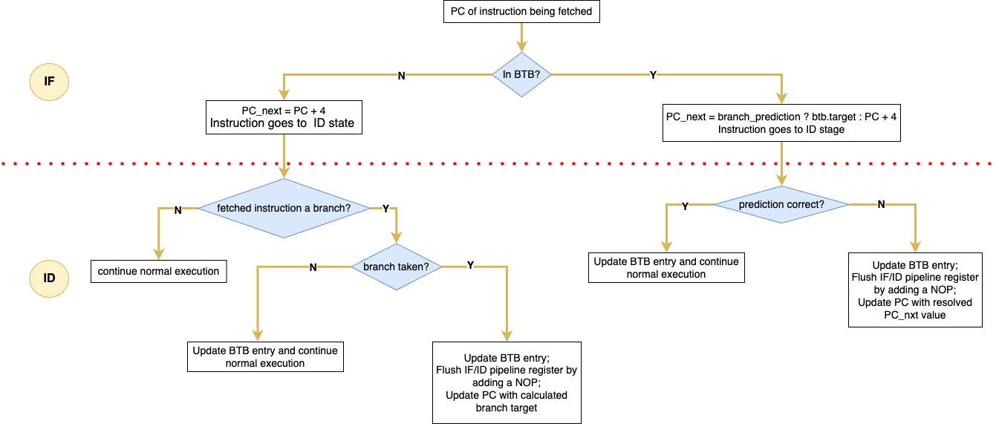

# RISC-V-Pipeline-Processor
This project implements a 32-bit pipelined RISC processor in SystemVerilog, designed as part of a self-driven learning initiative. The processor supports a 5-stage pipeline — Fetch, Decode, Execute, Memory, and Write Back — with modules for hazard detection, data forwarding, and branch control.

  

## 🧠 Branch Prediction & Control Hazard Resolution

This design includes a **Branch Target Buffer (BTB)** with a **2-bit saturating FSM-based predictor** to mitigate control hazards in a 5-stage pipelined RISC-V processor. Branches are resolved in the **ID stage** to minimize the penalty from mispredictions.

Each BTB entry is 60 bits wide and is structured as follows:

| Field       | Bit Range | Description                                |
|-------------|-----------|--------------------------------------------|
| `valid`     | [59]      | Indicates whether the BTB entry is valid   |
| `tag`       | [58:34]   | Tag derived from PC[31:7]                  |
| `target`    | [33:2]    | Predicted branch target (word-aligned)     |
| `fsm_state` | [1:0]     | 2-bit FSM predictor (STRONG_NT to STRONG_T)|

**Note:**  
The BTB has 32 entries. Since RISC-V instructions are word-aligned, the lower two bits of the PC are always `00`. Therefore:
- `PC[6:2]` is used as the BTB index (5 bits)
- `PC[31:7]` is used as the tag (25 bits)

The control hazard resolution flow is illustrated below:

  

## ⚙️ Data Hazard Handling

To maintain high pipeline throughput while ensuring correctness, this design implements **data hazard resolution** using:

1. EX Stage Forwarding (`ex_data_fwd_unit`)
2. ID Stage Forwarding (`id_data_fwd_unit`)
3. Hazard Detection Unit (`hzd_detection_unit`)

### 🔁 1. EX Stage Forwarding (`ex_data_fwd_unit`)
This unit resolves *read-after-write (RAW)* hazards where the EX stage depends on data yet to be written back by later stages.

It selects between:
- The original register value from ID/EX,
- The result from EX/MEM, or
- The write-back value from MEM/WB,
based on matching destination (`rd`) and source (`rs1/rs2`) registers.

### 🔁 2. ID Stage Forwarding (`id_data_fwd_unit`)
For **branch instructions**, correct operand values are needed in the ID stage to resolve the branch decision. However, the register file might not yet contain updated data.

To address this, the ID-stage forwarding unit checks whether the source registers (`rs1`, `rs2`) of the branch instruction match the destination registers of **EX/MEM** or **MEM/WB**, and appropriate data is forwarded to ensure **correct and early branch resolution

### ⛔ 3. Load-Use & Branch Hazard Detection (`hzd_detection_unit`)
This unit inserts pipeline **stalls** when data cannot be forwarded safely:

- **Load-Use Hazard:** If a load instruction is in ID/EX, and its `rd` is needed in the next instruction, stall the pipeline for 1 cycle.
- **Branch-Use Hazard:** If a branch instruction uses operands that are yet ready to be forwarded (from ID/EX or EX/MEM), stall to avoid incorrect comparisons.

When a hazard is detected:
- `stall` signal is asserted,
- `PCWrite` is de-asserted,
- The IF/ID register is frozen and ID/EX is flushed in the next cycle. 

This guarantees safe and deterministic pipeline behavior across dependent instructions.

---------
# RV32I Instruction Set Documentation
Conforms to RISC-V Unprivileged ISA Spec v2.2.

## Supported Instructions

- Arithmetic - add,sub,addi
- Logical - and,or,xor,andi,ori,xori
- Shift - sll,srl,sra,slli,srli,srai
- Branch - beq,bne

---

## Arithmetic Instructions

### `add rd, rs1, rs2`

| Bits     | 31–25   | 24–20 | 19–15 | 14–12 | 11–7 | 6–0     |
|----------|---------|--------|--------|--------|------|----------|
| Value    | 0000000 | rs2    | rs1    | 000    | rd   | 0110011  |

**Description**: Adds the values in `rs1` and `rs2` and stores the result in `rd`.

**Implementation**:  
`x[rd] = x[rs1] + x[rs2]`

---

### `sub rd, rs1, rs2`

| Bits     | 31–25   | 24–20 | 19–15 | 14–12 | 11–7 | 6–0     |
|----------|---------|--------|--------|--------|------|----------|
| Value    | 0100000 | rs2    | rs1    | 000    | rd   | 0110011  |

**Description**: Subtracts `rs2` from `rs1` and stores the result in `rd`.

**Implementation**:  
`x[rd] = x[rs1] - x[rs2]`

---

### `addi rd, rs1, imm`

| Bits     | 31–20       | 19–15 | 14–12 | 11–7 | 6–0     |
|----------|-------------|--------|--------|------|----------|
| Value    | imm[11:0]   | rs1    | 000    | rd   | 0010011  |

**Description**: Adds the 12-bit sign-extended immediate to `rs1` and stores the result in `rd`.

**Implementation**:  
`x[rd] = x[rs1] + s_extend(immediate)`

---

## Logical Instructions

### `and rd, rs1, rs2`

| Bits     | 31–25   | 24–20 | 19–15 | 14–12 | 11–7 | 6–0     |
|----------|---------|--------|--------|--------|------|----------|
| Value    | 0000000 | rs2    | rs1    | 111    | rd   | 0110011  |

**Description**: Bitwise AND of `rs1` and `rs2`.

**Implementation**:  
`x[rd] = x[rs1] & x[rs2]`

### `or rd, rs1, rs2`

| Bits     | 31–25   | 24–20 | 19–15 | 14–12 | 11–7 | 6–0     |
|----------|---------|--------|--------|--------|------|----------|
| Value    | 0000000 | rs2    | rs1    | 110    | rd   | 0110011  |

**Description**: Bitwise OR of `rs1` and `rs2`.

**Implementation**:  
`x[rd] = x[rs1] | x[rs2]`

---

### `xor rd, rs1, rs2`

| Bits     | 31–25   | 24–20 | 19–15 | 14–12 | 11–7 | 6–0     |
|----------|---------|--------|--------|--------|------|----------|
| Value    | 0000000 | rs2    | rs1    | 100    | rd   | 0110011  |

**Description**: Bitwise XOR of `rs1` and `rs2`.

**Implementation**:  
`x[rd] = x[rs1] ^ x[rs2]`

---

### `andi rd, rs1, imm`

| Bits     | 31–20       | 19–15 | 14–12 | 11–7 | 6–0     |
|----------|-------------|--------|--------|------|----------|
| Value    | imm[11:0]   | rs1    | 111    | rd   | 0010011  |

**Description**: Bitwise AND of `rs1` with sign-extended immediate.

**Implementation**:  
`x[rd] = x[rs1] & s_extend(immediate)`

---

### `ori rd, rs1, imm`

| Bits     | 31–20       | 19–15 | 14–12 | 11–7 | 6–0     |
|----------|-------------|--------|--------|------|----------|
| Value    | imm[11:0]   | rs1    | 110    | rd   | 0010011  |

**Description**: Bitwise OR of `rs1` with sign-extended immediate.

**Implementation**:  
`x[rd] = x[rs1] | s_extend(immediate)`

---

### `xori rd, rs1, imm`

| Bits     | 31–20       | 19–15 | 14–12 | 11–7 | 6–0     |
|----------|-------------|--------|--------|------|----------|
| Value    | imm[11:0]   | rs1    | 100    | rd   | 0010011  |

**Description**: Bitwise XOR of `rs1` with sign-extended immediate.

**Implementation**:  
`x[rd] = x[rs1] ^ s_extend(immediate)`

---

## Shift Instructions

### `sll rd, rs1, rs2`

| Bits     | 31–25   | 24–20 | 19–15 | 14–12 | 11–7 | 6–0     |
|----------|---------|--------|--------|--------|------|----------|
| Value    | 0000000 | rs2    | rs1    | 001    | rd   | 0110011  |

**Description**: Logical left shift of `rs1` by lower 5 bits of `rs2`.

**Implementation**:  
`x[rd] = x[rs1] << x[rs2]`

---

### `srl rd, rs1, rs2`

| Bits     | 31–25   | 24–20 | 19–15 | 14–12 | 11–7 | 6–0     |
|----------|---------|--------|--------|--------|------|----------|
| Value    | 0000000 | rs2    | rs1    | 101    | rd   | 0110011  |

**Description**: Logical right shift of `rs1` by lower 5 bits of `rs2`.

**Implementation**:  
`x[rd] = x[rs1] >> x[rs2] (unsigned)`

---

### `sra rd, rs1, rs2`

| Bits     | 31–25   | 24–20 | 19–15 | 14–12 | 11–7 | 6–0     |
|----------|---------|--------|--------|--------|------|----------|
| Value    | 0100000 | rs2    | rs1    | 101    | rd   | 0110011  |

**Description**: Arithmetic right shift of `rs1` by lower 5 bits of `rs2`.

**Implementation**:  
`x[rd] = x[rs1] >> x[rs2] (signed)`

---

### `slli rd, rs1, shamt`

| Bits     | 31–25   | 24–20 | 19–15 | 14–12 | 11–7 | 6–0     |
|----------|---------|--------|--------|--------|------|----------|
| Value    | 0000000 | shamt  | rs1    | 001    | rd   | 0010011  |

**Description**: Performs logical shift on the value in register rs1 by the shift amount.

**Implementation**:  
`x[rd] = x[rs1] << shamt`

---

### `srai rd, rs1, shamt`

| Bits     | 31–25   | 24–20 | 19–15 | 14–12 | 11–7 | 6–0     |
|----------|---------|--------|--------|--------|------|----------|
| Value    | 0100000 | shamt  | rs1    | 101    | rd   | 0010011  |

**Description**: Performs arthemetic right shift on the value in register rs1 by the shift amount.
**Implementation**:  
`x[rd] = x[rs1] >> shamt (unsigned)`

---

### `srli rd, rs1, shamt`

| Bits     | 31–25   | 24–20 | 19–15 | 14–12 | 11–7 | 6–0     |
|----------|---------|--------|--------|--------|------|----------|
| Value    | 0000000 | shamt  | rs1    | 101    | rd   | 0010011  |

**Description**: Performs logical right shift on the value in register rs1 by the shift amount.
**Implementation**:  
`x[rd] = x[rs1] >> shamt (signed)`

---

## Load/Store Instructions

### `lw rd, offset(rs1)`

| Bits     | 31–20       | 19–15 | 14–12 | 11–7 | 6–0     |
|----------|-------------|--------|--------|------|----------|
| Value    | offset[11:0]| rs1    | 010    | rd   | 0000011  |

**Description**: Load 32-bit word from memory.

**Implementation**:  
`x[rd] = M[x[rs1] + s_extend(offset)]`

---

### `sw rs2, offset(rs1)`

| Bits     | 31–25      | 24–20 | 19–15 | 14-12 | 11–7     | 6-0    |
|----------|-------------|--------|--------|-------|--------------|---------|
| Value    | offset[11:5]| rs2    | rs1    | 010   |  offset[4:0] | 0100011 |

**Description**: Store 32-bit word into memory.

**Implementation**:  
`M[x[rs1] + s_extend(offset)] = x[rs2]`

--------

## Branch Instructions

### `beq rs1, rs2, imm`

| Bits     | 31         | 30-25         | 24–20  | 19–15 | 14-12 | 11–8         |  7          | 6-0     |
|----------|------------|---------------|--------|-------|-------|--------------|-------------|---------|
| Value    | offset[12] | offset [10:5] | rs2    | rs1   | 000   |  offset[4:1] | offset [11] | 1100011 |

**Description**: Branch if rs1 and rs2 are equal. 

**Implementation**:  
`if (x[rs1] == x[rs2]) PC = PC + s_extend(imm)`

### `bne rs1, rs2, imm`

| Bits     | 31         | 30-25         | 24–20  | 19–15 | 14-12 | 11–8         |  7          | 6-0     |
|----------|------------|---------------|--------|-------|-------|--------------|-------------|---------|
| Value    | offset[12] | offset [10:5] | rs2    | rs1   | 001   |  offset[4:1] | offset [11] | 1100011 |

**Description**: Branch if rs1 and rs2 are not equal. 

**Implementation**:  
`if (x[rs1] != x[rs2]) PC = PC + s_extend(imm)`

----------------
